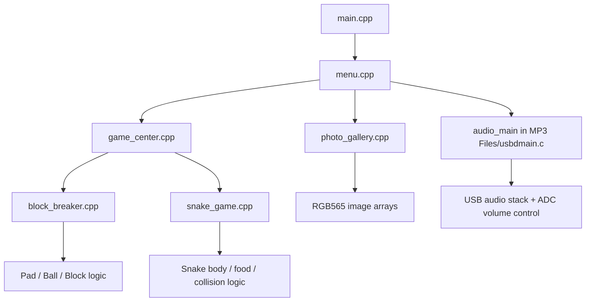

# Embedded Media Center

Embedded media-center project for the **Keil MCB1700 / LPC1768** board, with an LCD-based menu, a bitmap photo gallery, USB audio playback, and two joystick-driven games. The repository also includes a separate **Cyclone IV FPGA JPEG/DCT exploration** with SystemVerilog modules for 2-D DCT and later JPEG-style stages.

## Project scope

The embedded side of the project is organized around three required media-center functions:

- **Photo Gallery** — displays pre-converted RGB565 image arrays on the LCD
- **MP3 / USB Audio Mode** — streams audio from the host PC to the board speaker and uses the board potentiometer for volume control
- **Game Center** — launches **Block Breaker** and **Snake**

The FPGA side is kept as a separate extension in `JPEG Converter/` and includes modules for:
- 1-D row DCT
- 1-D column DCT
- 2-D DCT buffering/control
- quantization
- zigzag ordering
- run-length encoding
- Huffman-encoder stage scaffolding

## Repository layout

```text
embedded-media-center/
├── README.md
├── Media-Center.uvprojx
├── RTE/
├── Source Files/
│   ├── main.cpp
│   ├── menu.cpp / menu.hpp
│   ├── photo_gallery.cpp / photo_gallery.hpp
│   ├── game_center.cpp / game_center.hpp
│   ├── block_breaker.cpp / block_breaker.hpp
│   ├── snake_game.cpp / snake_game.hpp
│   ├── Board Files/
│   ├── Images/
│   └── MP3 Files/
├── JPEG Converter/
│   ├── JPEG_Converter.qpf / .qsf
│   ├── jpeg_fpga_init.v
│   ├── dct_1d_row.sv
│   ├── dct_1d_column.sv
│   ├── dct_2d.sv
│   ├── quantizer.sv
│   ├── zigzag.sv
│   ├── rle_encoder.sv
│   ├── huffman_encoder.sv
│   ├── jpeg_main.sv
│   ├── jpeg_pkg.sv
│   ├── jpeg_tb.sv
│   └── scripts/
└── docs/
```

## Embedded architecture



## Controls

### Main menu
- **Up / Down:** move selection
- **Select:** enter highlighted mode

### Photo gallery
- **Left / Right:** change displayed image
- **Select:** return to main menu

### Game center
- **Up / Down:** choose game
- **Select:** launch highlighted game
- **Left twice:** return to main menu

### Block Breaker
- **Left / Right:** move paddle
- **Select twice:** exit back out of the game flow

### Snake
- **Up / Down / Left / Right:** move snake
- **Select twice:** exit back out of the game flow

### MP3 / USB audio mode
- Audio streams from the host PC over USB to the board speaker.
- The board **potentiometer** changes volume.
- In the current implementation, **Select resets the board** to leave audio mode cleanly.

## Toolchains

### Embedded media center
- Keil uVision / ARM toolchain
- Keil **LPC1700 Device Family Pack**
- MCB1700 / LPC1768 board support
- LCD, joystick, USB audio, and ADC peripherals

### JPEG / FPGA extension
- Intel Quartus II
- Cyclone IV E (`EP4CE115F29C7`)
- SystemVerilog source files in `JPEG Converter/`

## Notes on included source

- `Source Files/Board Files/` contains board-facing display / input support files used by the media-center application.
- `Source Files/MP3 Files/` contains the USB audio support code and related source used for the audio mode.
- `Source Files/Images/` contains exported LCD bitmap assets and the original artwork files used to generate them.
- `JPEG Converter/scripts/generate_dct_cosines.py` is a helper used to generate or check fixed-point cosine terms for the DCT work.

## Known limitations

- The embedded project depends on the **Keil LPC1700 DFP** and board support components not mirrored here as standalone vendor drops.
- The JPEG folder is best treated as a **development snapshot / extension path** rather than a fully integrated end-to-end image compressor.
- The Quartus top-level file in this snapshot is `jpeg_fpga_init.v`; the other JPEG modules are kept as modular work for the DCT/JPEG pipeline.

## Cleanup performed for this GitHub snapshot

This repository snapshot removes generated build outputs, IDE workspace clutter, packed Git metadata, and temporary Quartus / Keil artifacts so the project is easier to browse on GitHub while keeping the actual source files and project files intact.
